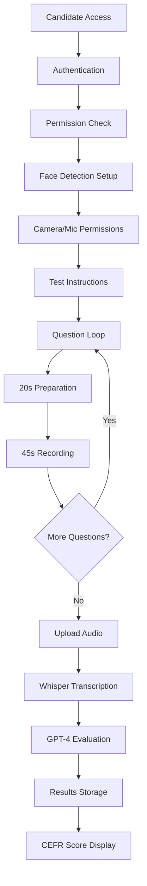
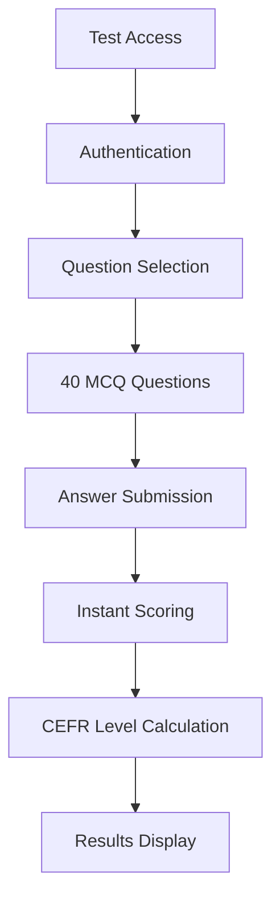
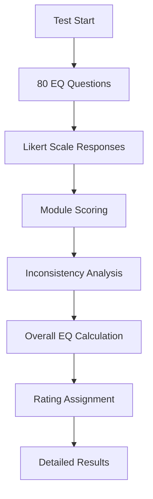
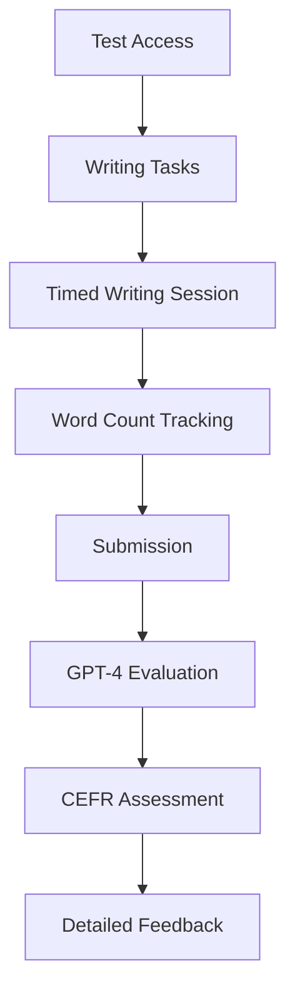

# 🚀 LUMI6 PRODUCT FLOW ROADMAP

## 📋 Table of Contents
- [System Overview](#system-overview)
- [Tech Stack](#tech-stack)
- [Core Features & Functionality](#core-features--functionality)
- [Test Flow Architecture](#test-flow-architecture)
- [User Roles & Permissions](#user-roles--permissions)
- [Database Architecture](#database-architecture)
- [AI & Processing Pipeline](#ai--processing-pipeline)
- [Credit Management System](#credit-management-system)
- [Pending Features](#pending-features)
- [Go-Live Priority Features](#go-live-priority-features)
- [Production Deployment](#production-deployment)

---

## 🎯 System Overview

**Lumi6** is a comprehensive CEFR-based language assessment platform that provides:
- AI-powered speaking assessments with face detection
- Multiple-choice proficiency testing
- Emotional Intelligence (EQ) assessments
- Writing evaluations with AI feedback
- Multi-tenant company management
- Granular credit-based access control

---

## 🛠️ Tech Stack

### **Frontend (React + TypeScript)**
```json
{
  "core": {
    "react": "^18.3.1",
    "typescript": "^5.5.3",
    "vite": "^5.4.1",
    "react-router-dom": "^6.26.2"
  },
  "ui_framework": {
    "tailwindcss": "^3.4.11",
    "@radix-ui/*": "Latest (20+ components)",
    "shadcn/ui": "Complete component library",
    "lucide-react": "^0.462.0"
  },
  "state_management": {
    "@tanstack/react-query": "^5.56.2",
    "react-hook-form": "^7.53.0",
    "zod": "^3.23.8"
  },
  "ai_integration": {
    "face-api.js": "^0.22.2",
    "axios": "^1.9.0"
  },
  "utilities": {
    "jwt-decode": "^4.0.0",
    "date-fns": "^3.6.0",
    "recharts": "^2.12.7",
    "jspdf": "^3.0.1",
    "file-saver": "^2.0.5"
  }
}
```

### **Backend (Node.js + Express)**
```json
{
  "runtime": {
    "node.js": "20+",
    "express": "^4.18.3",
    "typescript": "^5.4.2"
  },
  "database": {
    "@prisma/client": "^5.10.0",
    "postgresql": "15+"
  },
  "authentication": {
    "jsonwebtoken": "^9.0.2",
    "bcryptjs": "^2.4.3"
  },
  "ai_services": {
    "openai": "^4.100.0",
    "whisper": "Local + API"
  },
  "security": {
    "helmet": "^8.1.0",
    "cors": "^2.8.5",
    "express-rate-limit": "^7.5.0"
  },
  "file_processing": {
    "multer": "^1.4.5-lts.1",
    "ffmpeg": "System dependency"
  },
  "utilities": {
    "winston": "^3.17.0",
    "zod": "^3.22.4",
    "xlsx": "^0.18.5",
    "compromise": "^14.11.3"
  }
}
```

### **AI & Processing Services**
```json
{
  "speech_recognition": {
    "whisper_api": "OpenAI Whisper API (Production)",
    "whisper_local": "Local Python server (Development)",
    "fallback": "Dual-mode support"
  },
  "face_detection": {
    "face_api_js": "Browser-based face detection",
    "models": "TinyFaceDetector"
  },
  "language_evaluation": {
    "openai_gpt4": "Speaking & Writing assessment",
    "custom_algorithms": "EQ evaluation engine"
  },
  "media_processing": {
    "ffmpeg": "Audio/video conversion",
    "format_support": "WebM, OGG, WAV, MP4"
  }
}
```

### **Infrastructure & Deployment**
```yaml
development:
  database: PostgreSQL (Local)
  storage: Local filesystem
  whisper: Local Python server
  
production_ready:
  containerization: Docker + Docker Compose
  database: PostgreSQL with connection pooling
  storage: AWS S3 / CloudFlare R2
  cdn: CloudFlare / AWS CloudFront
  monitoring: Prometheus + Grafana
  logging: Winston + ELK Stack
  ci_cd: GitHub Actions
```

---

## 🎯 Core Features & Functionality

### **1. Multi-Tenant Company Management**
- ✅ Company registration and admin creation
- ✅ Role-based access control (SuperAdmin, CompanyAdmin)
- ✅ Company-specific candidate management
- ✅ Credit allocation and usage tracking
- ✅ Test permission management per company

### **2. Candidate Management**
- ✅ Candidate creation and profile management
- ✅ Bulk candidate operations
- ✅ Multi-test progress tracking
- ✅ Comprehensive result reporting
- ✅ PDF report generation

### **3. Assessment Types**

#### **Speaking Assessment (AI-Powered)**
- ✅ Face detection for proctoring
- ✅ Real-time audio/video recording
- ✅ Whisper-based transcription (API + Local)
- ✅ GPT-4 evaluation with CEFR scoring
- ✅ Pronunciation, fluency, grammar analysis
- ✅ Session recovery for interrupted tests

#### **Proficiency Testing (MCQ)**
- ✅ 40-question multiple-choice format
- ✅ CEFR-aligned question bank
- ✅ Instant scoring and level determination
- ✅ Comprehensive question management
- ✅ Bulk question import/export

#### **EQ Assessment**
- ✅ 80-question emotional intelligence test
- ✅ Advanced EQ evaluation algorithm
- ✅ Module-based scoring system
- ✅ Inconsistency detection
- ✅ Comprehensive EQ reporting

#### **Writing Assessment**
- ✅ Multiple writing task types
- ✅ Timed writing sessions
- ✅ AI-powered evaluation with GPT-4
- ✅ CEFR-based scoring
- ✅ Word count tracking

### **4. Question Management System**
- ✅ Unified question management interface
- ✅ CRUD operations for all question types
- ✅ Bulk import/export capabilities
- ✅ Advanced filtering and search
- ✅ Multi-language support
- ✅ Question statistics and analytics

### **5. Credit Management System**
- ✅ Per-test-type credit allocation
- ✅ Granular permission control
- ✅ Complete transaction audit trail
- ✅ Credit expiry management
- ✅ Usage analytics and reporting
- ✅ Automated credit validation

### **6. Reporting & Analytics**
- ✅ Individual candidate reports
- ✅ Company-wide analytics
- ✅ Test completion tracking
- ✅ Performance metrics
- ✅ PDF report generation
- ✅ CSV data export

---

## 🔄 Test Flow Architecture

### **1. Speaking Test Flow**


### **2. Proficiency Test Flow**


### **3. EQ Test Flow**


### **4. Writing Test Flow**


---

## 👥 User Roles & Permissions

### **Super Admin**
- ✅ Complete system access
- ✅ Company management (create, edit, delete)
- ✅ Global candidate overview
- ✅ Question bank management
- ✅ Credit allocation and management
- ✅ System analytics and reporting
- ✅ Test permission configuration

### **Company Admin**
- ✅ Company-specific dashboard
- ✅ Candidate management within company
- ✅ Test creation and assignment
- ✅ Company results and analytics
- ✅ Credit usage monitoring
- ✅ Candidate report generation

### **Candidates**
- ✅ Test access via unique links
- ✅ Password-protected test sessions
- ✅ Multi-device support
- ✅ Session recovery capabilities
- ✅ Results viewing (if enabled)

---

## 🗄️ Database Architecture

### **Core Models**
```prisma
// User Management
model Admin { /* SuperAdmin, CompanyAdmin roles */ }
model Company { /* Multi-tenant companies */ }
model Candidate { /* Test takers */ }

// Test Management
model Test { /* Speaking tests */ }
model ProficiencyTest { /* MCQ tests */ }
model EQTest { /* EQ assessments */ }
model WritingTest { /* Writing assessments */ }

// Question Banks
model Question { /* Speaking questions */ }
model GlobalProficiencyQuestion { /* MCQ questions */ }
model EQQuestion { /* EQ questions */ }
model WritingQuestion { /* Writing prompts */ }

// Results & Analytics
model TestResult { /* Speaking results */ }
model ProficiencyResult { /* MCQ results */ }
model EQResult { /* EQ results */ }
model WritingResult { /* Writing results */ }

// Credit Management
model CompanyCredit { /* Credit balances per test type */ }
model CompanyTestPermission { /* Test access permissions */ }
model CreditTransaction { /* Audit trail */ }
```

### **Key Relationships**
- **One-to-Many**: Company → Candidates, Company → Tests
- **Many-to-Many**: Tests ↔ Questions (via junction tables)
- **Polymorphic**: Candidates → Multiple test result types
- **Audit Trail**: All credit operations tracked

---

## 🤖 AI & Processing Pipeline

### **Speech Processing Pipeline**
1. **Audio Capture**: WebRTC MediaRecorder API
2. **Format Conversion**: FFmpeg (WebM → OGG/WAV)
3. **Transcription**: 
   - Primary: OpenAI Whisper API
   - Fallback: Local Whisper server
4. **Evaluation**: GPT-4 with CEFR-specific prompts
5. **Scoring**: Multi-dimensional analysis (fluency, grammar, vocabulary, pronunciation)

### **Face Detection System**
- **Library**: Face-API.js (TinyFaceDetector)
- **Purpose**: Test integrity and proctoring
- **Models**: Lightweight browser-based detection
- **Privacy**: No face data stored, real-time processing only

### **Writing Evaluation**
- **Input**: Text submissions with word count tracking
- **Processing**: GPT-4 with writing-specific evaluation criteria
- **Output**: CEFR level, detailed feedback, improvement suggestions

### **EQ Assessment Algorithm**
- **Custom Logic**: Proprietary EQ calculation engine
- **Modules**: Self-awareness, Empathy, Social skills, etc.
- **Inconsistency Detection**: Response pattern analysis
- **Scoring**: Normalized scores across multiple dimensions

---

## 💳 Credit Management System

### **Architecture**
- **Per-Test-Type Credits**: Separate pools for Speaking, Proficiency, EQ, Writing
- **Permission Matrix**: Companies can be restricted to specific test types
- **Transaction Logging**: Complete audit trail for all credit operations
- **Expiry Management**: Configurable credit expiration dates

### **Business Logic**
```typescript
// Example: Company A (EQ Only)
testPermissions: [TestType.EQ]
credits: { EQ: 1000, SPEAKING: 0, PROFICIENCY: 0, WRITING: 0 }

// Example: Company B (Multi-Type)
testPermissions: [TestType.EQ, TestType.SPEAKING, TestType.WRITING]
credits: { EQ: 500, SPEAKING: 1000, WRITING: 2000, PROFICIENCY: 0 }
```

### **Validation Flow**
1. Check test permission for company
2. Validate available credits for test type
3. Consume credits on test creation
4. Log transaction with audit trail
5. Update company credit balance

---

## ⏳ Pending Features

### **High Priority (P1)**
```typescript
// Company Admin Dashboard
- [ ] Tests Table implementation
- [ ] Results Table with filtering
- [ ] Company Settings management
- [ ] Candidate invitation system

// Super Admin Features
- [ ] Advanced Reports section
- [ ] Analytics dashboard with charts
- [ ] System Settings configuration
- [ ] Company Credit Management UI (In Progress)

// API Improvements
- [ ] Super admin authorization checks for credit routes
- [ ] Company creation/listing logic completion
- [ ] Test assignment workflows
```

### **Medium Priority (P2)**
```typescript
// Enhanced Features
- [ ] Bulk candidate import functionality
- [ ] Advanced filtering and search
- [ ] Email notification system
- [ ] Automated report scheduling
- [ ] Multi-language UI support

// Performance Optimizations
- [ ] Redis caching implementation
- [ ] Database query optimization
- [ ] CDN integration for static assets
- [ ] Background job processing
```

### **Low Priority (P3)**
```typescript
// Advanced Integrations
- [ ] SSO (SAML/OAuth) integration
- [ ] API webhooks for external systems
- [ ] Advanced proctoring features
- [ ] Mobile app development
- [ ] Real-time notifications via WebSocket
```

---

## 🎯 Go-Live Priority Features

### **CRITICAL (Must Have)**
1. **✅ Core Test Functionality**
   - All 4 test types working (Speaking, Proficiency, EQ, Writing)
   - AI evaluation pipelines operational
   - Result generation and storage

2. **✅ User Management**
   - Multi-tenant company system
   - Role-based access control
   - Authentication and authorization

3. **✅ Credit System**
   - Per-test-type credit management
   - Permission validation
   - Transaction audit trail

4. **🚧 Company Admin Dashboard** (90% Complete)
   - Tests table implementation needed
   - Results table with proper filtering
   - Company settings management

### **HIGH PRIORITY (Should Have)**
1. **📋 Super Admin Features**
   - ✅ Company management
   - ✅ Global candidate overview
   - ✅ Question management
   - 🚧 Credit management UI (In Progress)
   - ❌ Advanced reporting dashboard

2. **🔒 Security & Stability**
   - ✅ Rate limiting implemented
   - ✅ Security headers configured
   - ❌ Production environment variables
   - ❌ Database connection pooling

3. **📊 Reporting System**
   - ✅ Individual candidate reports
   - ✅ PDF generation
   - ❌ Automated report scheduling
   - ❌ Advanced analytics dashboard

### **MEDIUM PRIORITY (Could Have)**
1. **📧 Communication Features**
   - ❌ Email notifications
   - ❌ Candidate invitation system
   - ❌ Test completion alerts

2. **⚡ Performance Optimizations**
   - ❌ Redis caching
   - ❌ CDN integration
   - ❌ Background job processing

---

## 🚀 Production Deployment

### **Infrastructure Requirements**
```yaml
minimum_specs:
  cpu: 2 vCPUs
  memory: 4GB RAM
  storage: 50GB SSD
  database: PostgreSQL 15+
  
recommended_specs:
  cpu: 4 vCPUs
  memory: 8GB RAM
  storage: 100GB SSD
  database: PostgreSQL 15+ with read replicas
  cache: Redis cluster
  cdn: CloudFlare or AWS CloudFront
```

### **Environment Configuration**
```bash
# Critical Environment Variables
DATABASE_URL=postgresql://...
JWT_SECRET=secure_32_char_minimum
OPENAI_API_KEY=sk-...
WHISPER_MODE=api  # Use API for production
FRONTEND_URL=https://yourdomain.com
NODE_ENV=production

# Optional but Recommended
REDIS_URL=redis://...
AWS_S3_BUCKET=lumi6-files
LOG_LEVEL=info
```

### **Deployment Checklist**
- [ ] SSL certificates configured
- [ ] Environment variables secured
- [ ] Database migrations applied
- [ ] File storage configured (S3/R2)
- [ ] CDN setup for static assets
- [ ] Monitoring and logging configured
- [ ] Backup strategy implemented
- [ ] Error tracking (Sentry) configured

---

## 📈 Success Metrics

### **Technical KPIs**
- API response time < 200ms
- 99.9% uptime
- Audio processing < 30 seconds
- Concurrent users: 1000+

### **Business KPIs**
- Test completion rate > 95%
- User satisfaction score > 4.5/5
- Credit utilization tracking
- Company retention rate

---

## 🔄 Next Steps

### **Week 1-2: Complete Go-Live Features**
1. Finish Company Admin dashboard tables
2. Implement Super Admin credit management UI
3. Add missing authorization checks
4. Complete company creation/listing APIs

### **Week 3-4: Production Readiness**
1. Set up production infrastructure
2. Configure monitoring and logging
3. Implement security hardening
4. Performance testing and optimization

### **Week 5+: Advanced Features**
1. Email notification system
2. Advanced reporting dashboard
3. Performance optimizations
4. Additional integrations

---

*This roadmap is a living document and will be updated as features are completed and new requirements emerge.* 